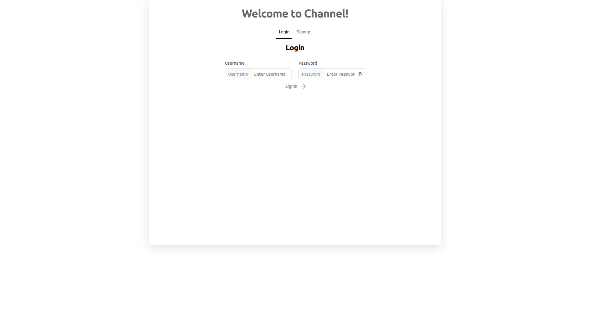
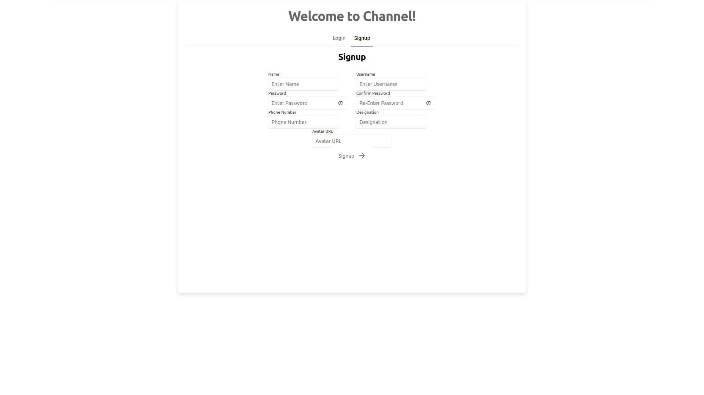
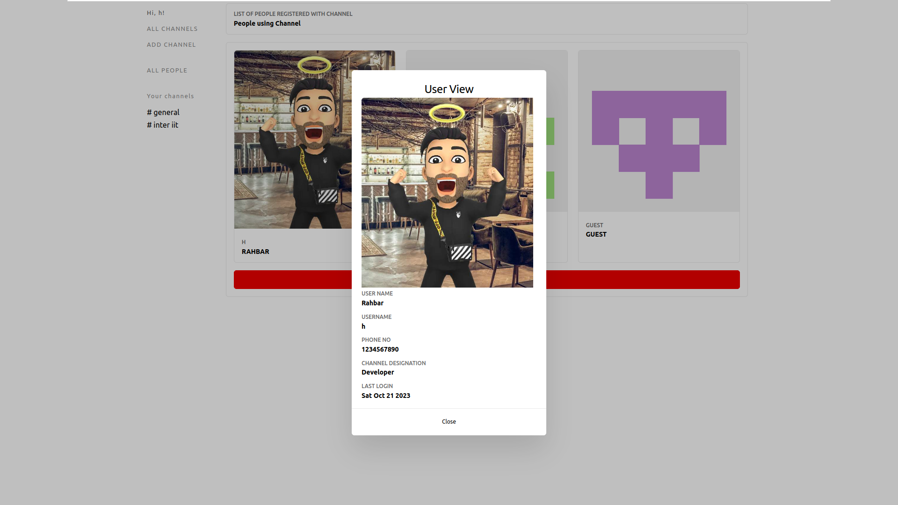
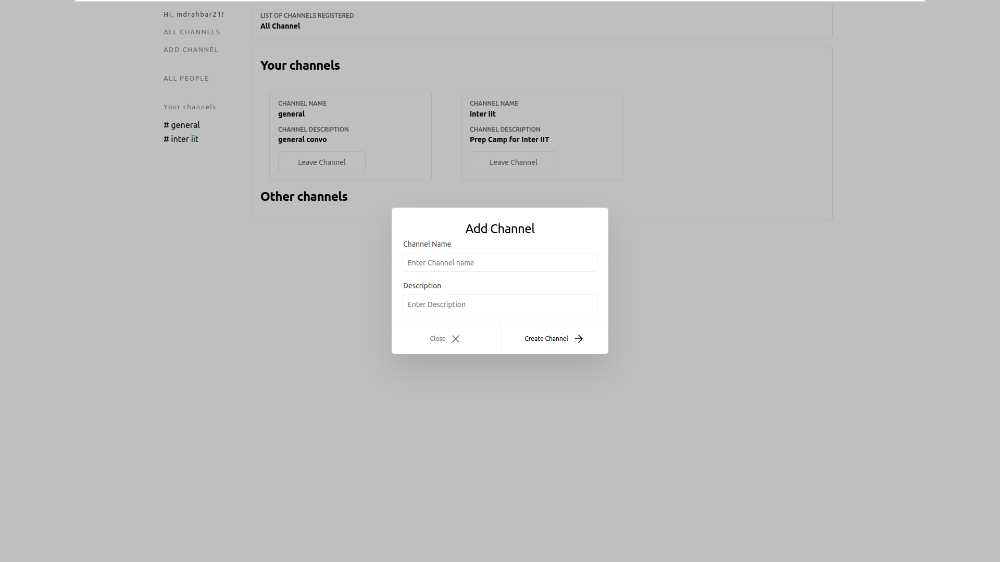
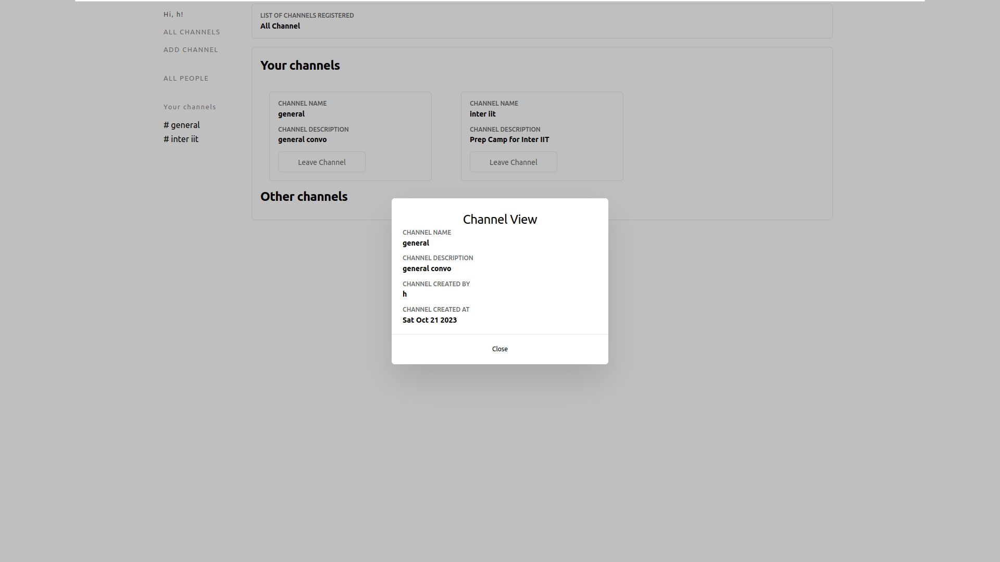
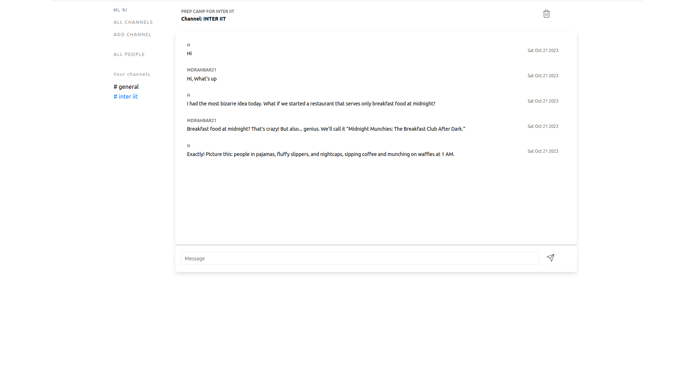

# ChatApp

**Public Chat Room System for IBY (I'm Beside You)**

## Developed By

**Md Rahbar (B.Tech, IIT Kanpur'25)** <br />
mdrahbar21@iitk.ac.in

## Description
This application is a chat room system that allows people to send text messages to one another in public rooms in real-time within an organisation.  Every room has a unique name and purpose associated with it.

## ER Diagram


## How to Run
```bash
git clone https://github.com/mdrahbar21/chatApp.git
cd chatApp
## build the frontend
cd frontend

## install nvm (if not installed already)
curl -o- https://raw.githubusercontent.com/nvm-sh/nvm/v0.39.0/install.sh | bash
## Either **Restart your terminal** or add nvm to your shell profile using following command (copy and paste all 3 lines at once in your terminal)
export NVM_DIR="$HOME/.nvm"
[ -s "$NVM_DIR/nvm.sh" ] && \. "$NVM_DIR/nvm.sh"  # This loads nvm
[ -s "$NVM_DIR/bash_completion" ] && \. "$NVM_DIR/bash_completion"  # This loads nvm bash_completion

nvm install 16
npm ci
npm run build

## run the server
cd ..
go mod download
go mod tidy
go build -o main ./cmd/server
./main
```

**Run it on http://localhost:8080**

## Tech Stack

### Backend

The backend of the application has been developed using **Go**.
Go is a statically typed, compiled programming language developed at Google. It is known for its better memory safety, garbage collection, and concurrency.

### Frontend

For the frontend, **React** was employed. It's a free and open-source front-end JavaScript library that is used for building user interfaces based on UI components. React was originally developed at Facebook and was deemed a suitable choice for this project.

### Database

As for the database, **SQLite** was utilized. The code has been written in a manner that allows for easy switching to other SQL databases like PostgreSQL if required.

## DB Schema

```sql
CREATE TABLE "channels" (
	"name"	text,
	"description"	text,
	"created_at"	integer,
	"user_username"	text,
	PRIMARY KEY("name"),
	CONSTRAINT "fk_channels_user" FOREIGN KEY("user_username")
	REFERENCES "users"("username") ON DELETE SET NULL ON UPDATE CASCADE
);
```

```sql
CREATE TABLE "users" (
	"username"	text,
	"password"	text,
	"name"	text,
	"last_login_at"	integer,
	"phone_no"	text,
	"designation"	text,
	"avatar_url"	text,
	PRIMARY KEY("username")
);
```

```sql
CREATE TABLE "messages" (
	"id"	integer,
	"content"	text,
	"time_sent_at"	integer,
	"user_username"	text,
	"channel_name"	text,
	PRIMARY KEY("id"),
	CONSTRAINT "fk_messages_channel" FOREIGN KEY("channel_name")
	REFERENCES "channels"("name") ON DELETE SET NULL ON UPDATE CASCADE,
	CONSTRAINT "fk_messages_user" FOREIGN KEY("user_username")
	REFERENCES "users"("username") ON DELETE SET NULL ON UPDATE CASCADE
);

-- INDEX
CREATE INDEX "idx_time_sent_at" ON "messages" (
	"time_sent_at"
);

```

```sql
CREATE TABLE "channel_users" (
	"user_username"	text,
	"channel_name"	text,
	CONSTRAINT "fk_channel_users_channel" FOREIGN KEY("channel_name")
	REFERENCES "channels"("name") ON DELETE CASCADE ON UPDATE CASCADE,
	CONSTRAINT "fk_channel_users_user" FOREIGN KEY("user_username")
	REFERENCES "users"("username") ON DELETE CASCADE ON UPDATE CASCADE,
	PRIMARY KEY("user_username","channel_name")
);
```

## Screenshots

Login Page


Signup Page


Users View


Add New ChatRoom/Channel


Channel View


ChatRoom


## Run it on localhost:8080